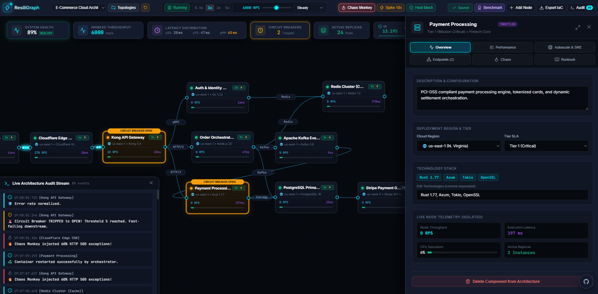

<p align="center">
  <a href="https://github.com/Girouetten21/ResiliGraph">
    
  </a>
</p>

<h1 align="center">⚡ ResiliGraph</h1>

<p align="center">
  <strong>Interactive Distributed Architecture & Chaos Simulation Engine</strong>
  <br />
  <em>Living System Specifications • Real-Time Queuing Theory • Automated SRE Benchmarking</em>
</p>

<p align="center">
  <a href="https://github.com/Girouetten21/ResiliGraph"></a>
  <a href="https://www.typescriptlang.org/"></a>
  <a href="https://react.dev/"></a>
  <a href="https://vitejs.dev/"></a>
  <a href="#"></a>
  <a href="#"></a>
  <a href="docs/ATTRIBUTION_AND_LICENSE.md"></a>
</p>

<p align="center">
  <a href="https://resiligraph.vercel.app">
    
  </a>
</p>

<br />

> **ResiliGraph** is an open-source, interactive simulation engine and living specification platform for distributed systems. It turns architecture designs into an **interactive, reactive runtime canvas** powered by queuing theory, horizontal pod autoscaling (HPA), cross-region latency penalties, chaos engineering fault injection drills, automated reliability scorecard benchmarks, and one-click export to Docker Compose and AWS Terraform.
> 
> 🌐 **Live Interactive Demo:** Experience ResiliGraph directly in your browser without any setup at **[resiligraph.vercel.app](https://resiligraph.vercel.app)**.



---

## 🌟 Overview & Key Capabilities

Traditional architecture diagrams are static representations of a system. **ResiliGraph** brings systems engineering into an executable, simulated domain, giving software architects, backend engineers, and SREs an interactive canvas to understand, test, and document distributed topologies under realistic load:

- 🚀 **60 FPS Reactive Canvas Engine:** Smooth pan, zoom, drag-and-drop, and visual **drag-to-connect wiring** between ports with glowing packet streams traveling along cubic Bézier interconnects.
- 📐 **Fixed-Dimension Grid Nodes:** Uniform, crisp card dimensions (`210px x 105px`) with real-time throughput metrics, region tags, health indicators, and active replica counters.
- 🖱️ **Rich Context Menu & Double-Click Inspection:** Right-click anywhere on the canvas or directly on nodes/edges to deploy microservices, databases, caches, queues, duplicate components, scale replicas, or sever connections. Single-click to move nodes without unwanted side-drawers; double-click to open full specifications.
- 🏆 **Automated SRE Reliability Benchmark & Scorecard:** One-click automated architectural audit that inspects Single Points of Failure (SPOF), Circuit Breaker coverage, Autoscaling headroom, and SLA reliability, assigning a comprehensive letter grade (A+ through F) with actionable engineering recommendations.
- ⚡ **Individual Node Queuing & Execution:** Nodes have completely isolated processing latency (`baseProcessingTimeMs`), concurrency limits, and true sliding-window throughput (RPS). If a downstream dependency slows down, upstream queues physically back up in real time.
- 📈 **Horizontal Pod Autoscaling (HPA):** Configurable CPU load thresholds that dynamically scale container replicas from 1 to $N$, instantly absorbing traffic surges and reducing per-instance load.
- 🌐 **Multi-Region Cloud Deployment:** Place nodes across `us-east-1`, `eu-central-1`, `ap-southeast-1`, or `us-west-2` with automatic speed-of-light cross-region fiber latency penalties (+75ms, +180ms).
- 💥 **Chaos Engineering & Fault Injection:** Kill services (OOM/Hardware crash), inject artificial network latency (+0ms to +1500ms), and dial in HTTP 500 error rates to observe cascading failures and circuit breaker state transitions (`CLOSED` ➔ `OPEN` ➔ `HALF_OPEN`).
- 📁 **Custom Topologies Manager:** Save, snapshot, rename, and manage multiple personalized architectures with persistent storage in local storage and built-in deletion safety confirmations.
- ⚙️ **One-Click Infrastructure as Code (IaC):** Automatically generates production-ready `docker-compose.yml`, AWS `main.tf` Terraform definitions, and complete `LIVING_SPEC.md` documentation matching the visual topology.

---

## 📚 Comprehensive Documentation

For in-depth guides, tutorials, and architectural references, visit the **[Documentation Center](docs/README.md)**:

- 📖 **[User Guide (docs/USER_GUIDE.md)](docs/USER_GUIDE.md):** Complete walkthrough of interactive gestures, simulation controls, chaos drills, metrics interpretation, and topology management.
- 🛠️ **[Developer & Contributor Guide (docs/DEVELOPER_GUIDE.md)](docs/DEVELOPER_GUIDE.md):** Deep technical dive into the discrete event loop, queuing theory math, canvas rendering pipeline, and instructions for adding custom components or exporters.
- 📜 **[Open Source Policy & Attribution (docs/ATTRIBUTION_AND_LICENSE.md)](docs/ATTRIBUTION_AND_LICENSE.md):** Open source terms, guidelines for modification, and commercial attribution requirements.

---

## 🎮 Interactive Controls & Gestures

| Action | Gesture / Control | Description |
| :--- | :--- | :--- |
| **Pan Canvas** | `Left-Click + Drag on Canvas` | Smoothly glide across the infinite architecture space |
| **Zoom Canvas** | `Mouse Wheel` or `+/- Buttons` | Zoom in and out from 40% to 250% |
| **Select Node** | `Left-Click Node Card` | Focuses node with a concentric rounded halo for moving or deleting |
| **Inspect Node Specs** | `Double-Click Node Card` | Opens the full Node Specification & Runbook Drawer on the right |
| **Connect Nodes** | `Click Right Port ➔ Drag to Left Port` | Pulls an elastic interconnect cable to link components |
| **Context Menu** | `Right-Click Canvas / Node / Link` | Context-aware actions to spawn components, duplicate, scale, or sever |
| **Delete Component** | `Select Component + Press Delete` | Removes the component and safely reroutes active traffic |
| **Manage Topologies** | `Header ➔ Topologies` | Snapshot current canvas as a new topology, rename, load, or delete |
| **Reliability Scorecard** | `Header ➔ Benchmark` | Runs an automated architectural stress audit and assigns a Resilience Grade |
| **Traffic Surge** | `Header ➔ Spike 10x` | Fires an instant 10x traffic surge to test autoscaling elasticity |
| **Chaos Monkey** | `Header ➔ Chaos Monkey` | Periodically causes random disruptions across the cluster with ember glow |
| **Export IaC** | `Header ➔ Export IaC` | Generates Docker Compose, AWS Terraform, and Markdown living docs |

---

## 🛠️ Technology Stack

- **Frontend Framework:** React 19 + TypeScript (strict mode with `verbatimModuleSyntax`)
- **Build System:** Vite 8 (instant HMR and production bundle optimization)
- **Graphics Pipeline:** HTML5 Canvas 2D Context with sub-pixel cubic Bézier calculations and device pixel ratio (DPR) scaling
- **Simulation Mathematics:** Discrete event scheduler, M/M/1 queuing model, sliding-window rate counters, token-bucket limiters, and HPA controllers
- **Design System:** Custom Vanilla CSS with dark cyber-fintech tokens, backdrop-filter glassmorphism, and modern typography (Inter & JetBrains Mono)
- **Icons:** Lucide React & Custom Clean SVG Badges

---

## 📦 Getting Started

### Prerequisites
- Node.js 18+ or 20+
- npm 9+ or pnpm 8+

### Installation & Local Run

```bash
# 1. Clone the repository
git clone https://github.com/Girouetten21/ResiliGraph.git
cd ResiliGraph

# 2. Install dependencies
npm install

# 3. Launch local development server
npm run dev
```

Open `http://localhost:5173/` in your browser to start designing and simulating distributed architectures.

### Building for Production

```bash
npm run build
```

The compiled, production-ready static assets will be output to the `dist/` directory.

---

## 🙏 Acknowledgments & Open Source Ecosystem

ResiliGraph is built upon the foundation of outstanding open-source technologies. We extend our sincere gratitude to the maintainers and communities behind:

- **[React](https://react.dev/)** — For the declarative component model powering our user interface and reactive state management.
- **[Vite](https://vitejs.dev/)** — For blazing-fast local development HMR and production bundle optimization.
- **[TypeScript](https://www.typescriptlang.org/)** — For strict type safety across simulation mathematical models and complex distributed topologies.
- **[Lucide React](https://lucide.dev/)** — For the clean, modern iconography across microservice categories, cloud regions, and chaos engineering drills.
- **[Oxlint](https://oxc.rs/)** — For high-performance static code analysis and linting.
- **HTML5 Canvas 2D API** — For hardware-accelerated graphics rendering supporting fluid 60 FPS Bézier curve telemetry streams.

---

## 📜 License & Open Source Attribution

ResiliGraph is open-source software created by **[Girouetten21](https://github.com/Girouetten21)** and licensed under the **[MIT License](docs/ATTRIBUTION_AND_LICENSE.md)**.

**Open Source & Attribution Policy:**
- Anyone is free to use, run, study, and modify this project for personal, educational, or internal organizational purposes.
- **Commercial Attribution Notice:** If you redistribute, package, or sell this software or derivative works based on its simulation engine or design system, **you must provide clear, prominent prior credit and attribution to ResiliGraph and its original author (@Girouetten21)** in your product documentation, interface, or repository. See the **[Attribution & License Policy](docs/ATTRIBUTION_AND_LICENSE.md)** for full details.
